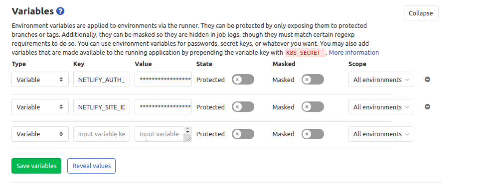

# flutter_web_netlify
Test, Build &amp; Deploy Flutter Web Apps from Gitlab CI

## Overview

In **GitLab-CI**, we setup our Flutter Web Environment, generate a web build, then deploy to **Netlify**.

## Prerequisites

Get the following details from your netlify-app dashboard

 - `NETLIFY_SITE_ID`
 - `NETLIFY_AUTH_TOKEN`

 

